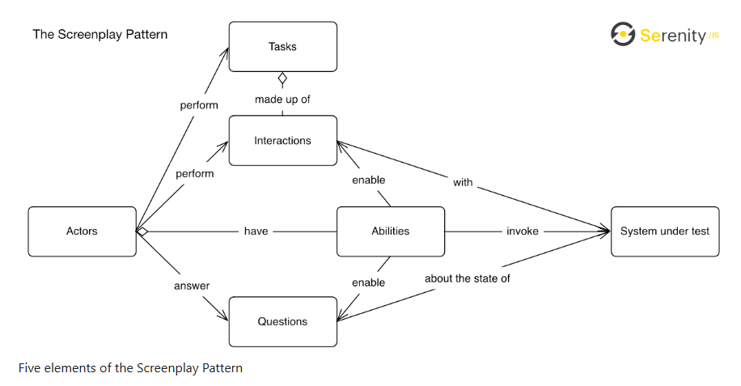
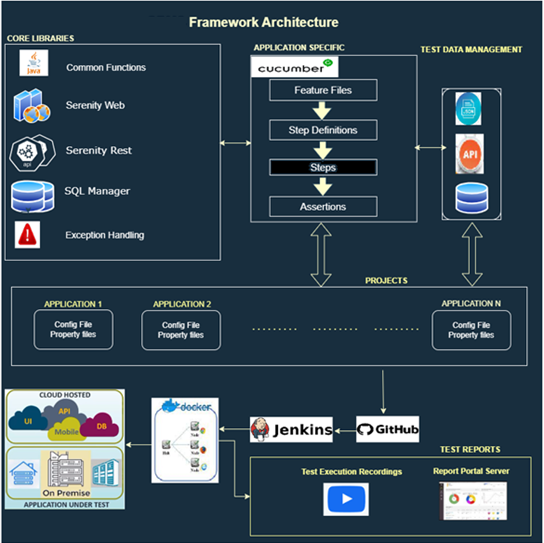
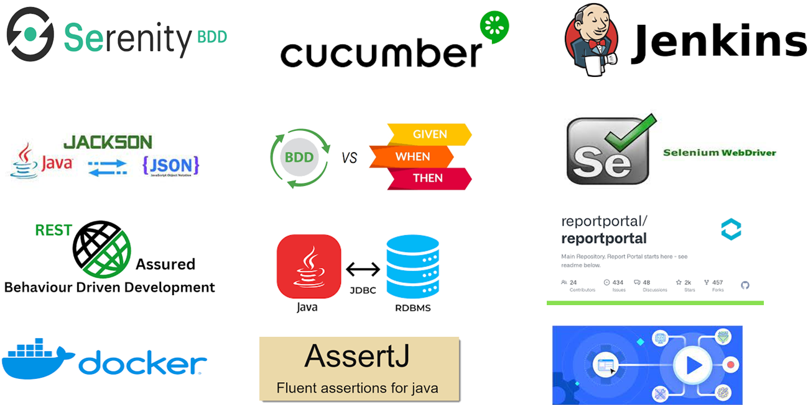
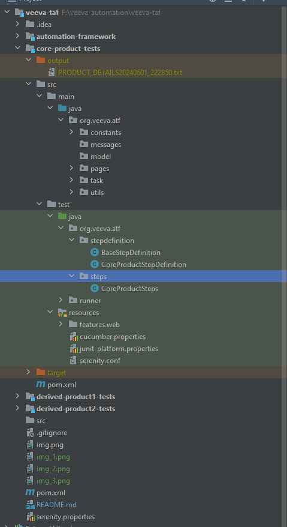
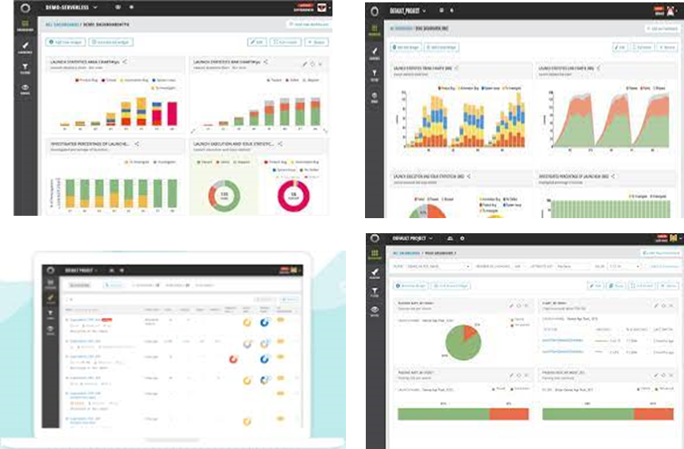

# Veeva-TAF - Screenplay Pattern with Serenity BDD
Veeva-TAF is functional automation testing framework for UI and API's testing. This framework adopted Serenity Screenplay Pattern foe an innovative, user-centred approach to writing high-quality automated acceptance tests. It steers your team towards effectively using layers of abstraction, helps your test scenarios capture the business vocabulary of your domain, and encourages good testing and software engineering habits

## Table of content
- [Architecture](#architecture)
- [Technology Stack](#tools)
- [Framework Hierarchy](#framework-hierarchy)
- [Framework Set up](#framework-set-up)
- [Reporting](#reporting)
- [Execution Commands](#execution)
- [Supported and Tested Browsers](#browser-support)

# Architecture 

* * *

# Tools 
* [Serenity BDD](https://serenity-bdd.info/)
* [Cucumber](https://cucumber.io/docs/cucumber/)
* [Screenplay Design Pattern](https://serenity-bdd.info/)
* [Rest Assured](https://cucumber.io/docs/gherkin/)
* [Java11](https://www.oracle.com/java/technologies/downloads/)
* [Little bit of docker](https://www.docker.com/)
* [Jenkins](https://www.jenkins.io/doc/)
* 
* * *

# Framework Hierarchy 
This framework is structured to be a multi-module. 

Let's say even if your team has multiple modules like module1, module2, module3; create only one automation repository which acts as umbrella for these sub-modules tests. Please create these sub-module modules within the main umbrella test repository. 

> **_NOTE:_** For multi-module team please create only *one automation repository*. Do not create multiple automation repositories.

Framework is designed to give reports individually to each sub-module. This approach helps us to see smoke testing reports of all the modules in single place .

* * *

# Framework Set up 
1. Install Java 11 , as this project built on Java 11
2. Setup Maven build tool
3. Intellij idea as development editor (optional)
4. Install Cucumber for Java plug-ins in your IDE
5. Setup Source Code Compilation version to Java 8 or higher.
4. Clone Github project this [repo](https://github.com/allipillir/veeva-taf.git).
5. Build the project to resolve all the depedencies. 
* * *
# Jenkins Integration 
 Future Scope 

# Reporting 
Framework is inbuilt with Serenity Reports for test scripts results, these reports can be seen in under "<Project/Module>\target\site\serenity\index.html"

* * *
# Execution Commands 
To execute web test across all modules 
##### Example
'''
To execute all web tests under project suite  \
  mvn clean install -Dcucumber.filter.tags="@web" 

To execute all test under Core Product module \
    mvn clean install -Dcucumber.filter.tags="@cp"

To execute all test under Derived Product One module \
-- mvn clean install -Dcucumber.filter.tags="@dp1"

To execute all test under Derived Product Tne module \
-- mvn clean install -Dcucumber.filter.tags="@dp2"

To execute only smoke suite \
-- mvn clean install -Dcucumber.filter.tags="@smoke"
'''
# Supported Browsers  
'''
This Project executed and supports \
         Microsoft EdgeEdge Version 125.0.2535.79 \
         FireFox Version 1260.1 \
         Google Chrome Version  125.0.6422. |
'''
In order to get more information about selenium grid integration with this framework, please contact rameshbabua2003@gmail.com